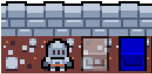

# Quantum puzzle game (Qungeon)
Simple puzzle game, reach the end to complete a level. This can be done by using gates in your toolbar ("bag") to manipulating the quantum state of pillars.
The player has to be next to an object to interact with it!



# Unitary Libary
The game was made using the Unitary library, which handles most of the quantum logic. More information can be found at:
https://github.com/quantumlib/unitary

Game examples can be found on this page and explanation on how to make use of the library.

# Play in the browser

The browser loads the original Python game code, assets, and levels directly.
Only the small browser adapter and the required Unitary Alpha modules live in
`web/`. There is no application backend, database, login, or save service.

Serve it locally from the repository root:

```bash
py -3.13 -m http.server 8000
```

Open <http://localhost:8000> to see the main menu. To jump directly into a
single level, use a URL such as <http://localhost:8000/?level=5>.

For production, serve the repository root from any HTTPS static-file host with
`index.html` as the entry point. No build step or server-side Python process is
required.

# Desktop development

## 1. Install

Requires Python 3.10-3.13. On Windows, Python 3.13 is recommended; Python
3.14 is currently too new for some of the game's scientific dependencies.

```bash
py -3.13 -m venv QungeonEnv313           # create the environment
source QungeonEnv313/Scripts/activate    # activate it in Git Bash
python -m pip install --upgrade pip setuptools wheel
python -m pip install -r requirements.txt
```

## 2. Launch

Run from the repo root - all asset and level paths are relative.

```bash
source QungeonEnv313/Scripts/activate
python Qungeon.py        # open the main menu
python Qungeon.py 5      # jump directly into level 5
```

An invalid or nonexistent level number exits with an error message instead of starting.

# Menus and settings

Both versions use the same Pygame menus and original pixel-art assets. No new
graphics dependency or build step is required.
UI text uses a bundled ASCII subset of DejaVu Sans; its license is in
`assets/DejaVu-LICENSE.txt`.

- **Start run** opens run settings first, then plays every level in order.
- **Level select** opens any of the eight available puzzles as a single level.
- **Settings** saves preferences automatically: in `.qungeon-settings.json` on
  desktop, or browser local storage. Preferences are separate between versions.
- **Decoherence time mode** is a saved preference only, marked coming soon;
  it does not add a timer or change quantum states yet.
- **Entanglement guides** toggles the connections shown on pillar hover.
- **Placeholder** reserves a setting for future use and has no gameplay effect.
- **How to play** opens an intentionally blank page with a Back button.

Use the mouse, arrow keys / WASD, or Tab / Shift+Tab to navigate menus; Enter
or Space selects. Escape goes back. During play, Escape (or the Pause button)
freezes gameplay, including movement and correlation animations. Resume,
restart the current level, return to the menu, or open How to Play from there.
Changing tabs or losing window focus also pauses the game.

Completing a single level or the final level opens a completion screen instead
of closing the game. The failure screen is implemented but has
no death or unwinnability detection connected - future solver can call
`game.show_failed()`; its Retry action restores the current level and inventory,
and Return to menu opens the main menu.

Run the tests with the project environment:

```bash
python -m pytest tests -q
```

# How to Play

## Goal

Reach the **END** tile. Pillars (quantum objects) block your path. Each pillar is a qubit,
and you can only walk through one when it is in a pure |0> state. Apply gates to collapse
the pillars out of your way.

## Controls

| Input | Action |
|---|---|
| `W` `A` `S` `D` | Move |
| `R` | Restart level |
| `Esc` / `Q` | Pause / open the in-game menu |
| Mouse drag | Drag a gate from the hotbar onto a pillar |
| Mouse hover | Hover a pillar to draw entanglement lines to its partners |

## Using gates

Gates live in the hotbar at the bottom of the screen. You start each level with some, and
pick up more by walking into loot boxes.

**You must be standing next to a pillar to drop a gate on it.** For controlled gates this
applies to the control pillar only — the target can be anywhere on the map.

- **Single-qubit gates** (`X`, `H`, `Z`, `RotY`) — drag the gate from the hotbar and drop it
  on the pillar. It applies immediately and the gate is consumed.
- **Controlled gates** (`CNOT`, `CHAD`) — drop the gate on the **control** pillar first, then
  drag from that control pillar to the **target** pillar. This entangles the two.

| Gate | Effect |
|---|---|
| `X` | Flip: \|0> ↔ \|1> |
| `H` | Superposition: puts the pillar in an even mix of \|0> and \|1> |
| `Z` | Phase flip (no change to the measured value, but it matters once entangled) |
| `RotY` | Partial Y rotation — nudges the state part-way between \|0> and \|1> |
| `CNOT` | Controlled flip: flips the target when the control is \|1> |
| `CHAD` | Controlled Hadamard: superposes the target when the control is \|1> |

## Reading a pillar

The pillar's tint tells you its state:

- **Blue** — \|1>, solid, you cannot pass
- **White / transparent** — pure \|0>, walkable
- **Reddish** — very close to \|0> but not exactly there, still blocking
- **Green channel** — the pillar carries a Z phase

Only an *exactly* pure \|0> is walkable — "almost zero" is not good enough. Entangled pillars
pulse through their correlated states, and hovering one draws dark blue lines to its partners.
